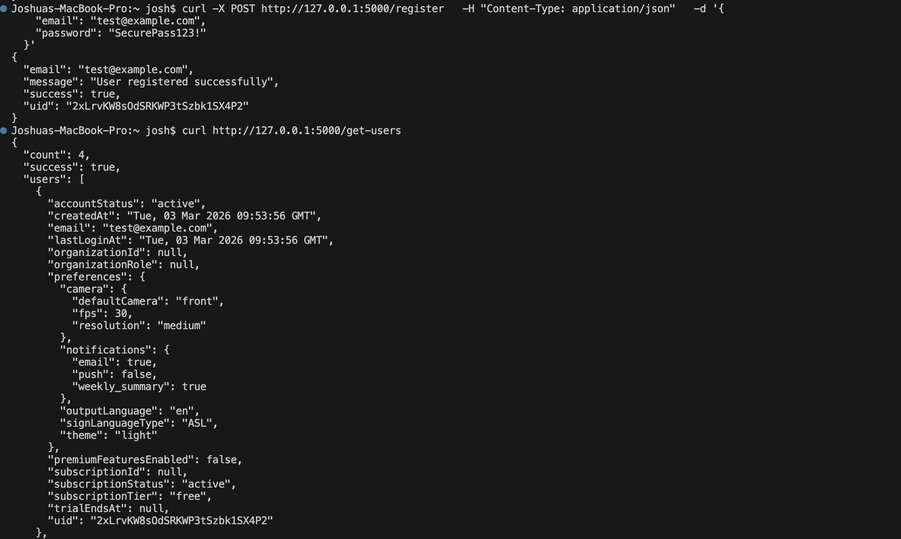
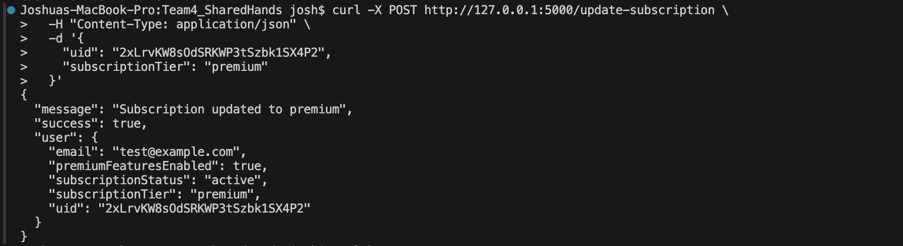
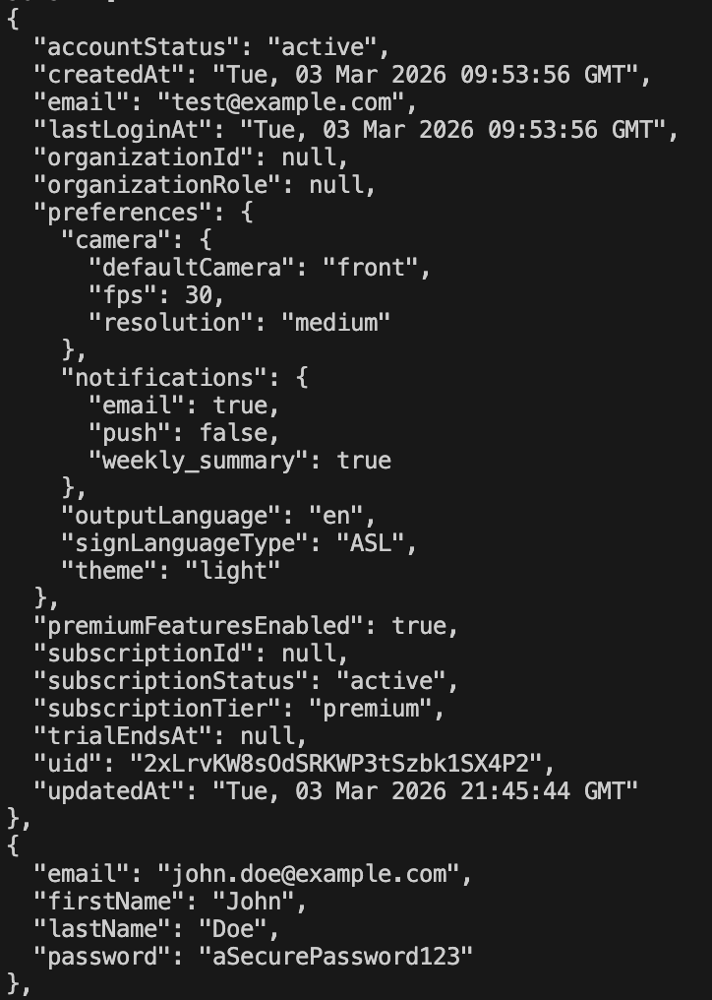

# User Collection Schema

```javascript
  // Identity & Authentication
  "uid": "string",                    
  "email": "string",                  
  
  // Account Management
  "createdAt": "timestamp",           
  "lastLoginAt": "timestamp",         // REQUIRED - Auto-generated
  "accountStatus": "string",          // REQUIRED - Default: 'active'
  
  // Subcription Status
  "subscriptionTier": "string",       // REQUIRED - 'free' | 'premium' | 'enterprise'
  "subscriptionStatus": "string",     // REQUIRED - 'active' | 'cancelled' | 'expired' | 'trialing'
  "subscriptionId": "string",
  "premiumFeaturesEnabled": "boolean", // REQUIRED - Default: false
  
  // User Preferences
  "preferences": {
    "outputLanguage": "string",       // REQUIRED - Default: 'en'
    "signLanguageType": "string",     // REQUIRED - Default: 'ASL'
    "camera": {
      "defaultCamera": "string",      // REQUIRED - Default: 'front'
      "resolution": "string",         // REQUIRED - Default: 'medium'
      "fps": "number"                 // REQUIRED - Default: 30
  
  // Organization
  "organizationId": "string | null",  // OPTIONAL - Enterprise only
  "organizationRole": "string | null", // OPTIONAL - 'admin' | 'member'
```

**Field Validation Rules:**
- `uid`: Must match Firebase Auth UID
- `email`: Must be valid email format
- `subscriptionTier`: Must be one of: 'free', 'premium', 'enterprise'
- `subscriptionStatus`: Must be one of: 'active', 'cancelled', 'expired', 'trialing'



NOTE: Image does not accurately reflect the  number of items within each document as presented here, this will be changed and the corresponding image testing this will be fixed as well.


Testing new function to change the subscription status of a user.



Change appears in user collection granting the user access to premium features and changing their status to active under premium tier.



