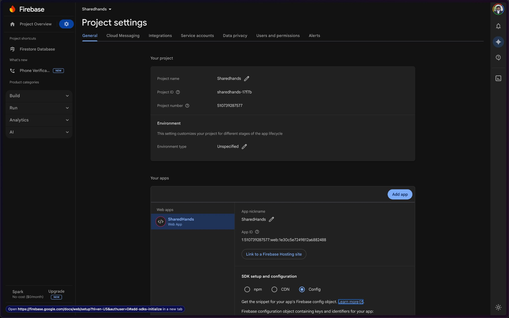
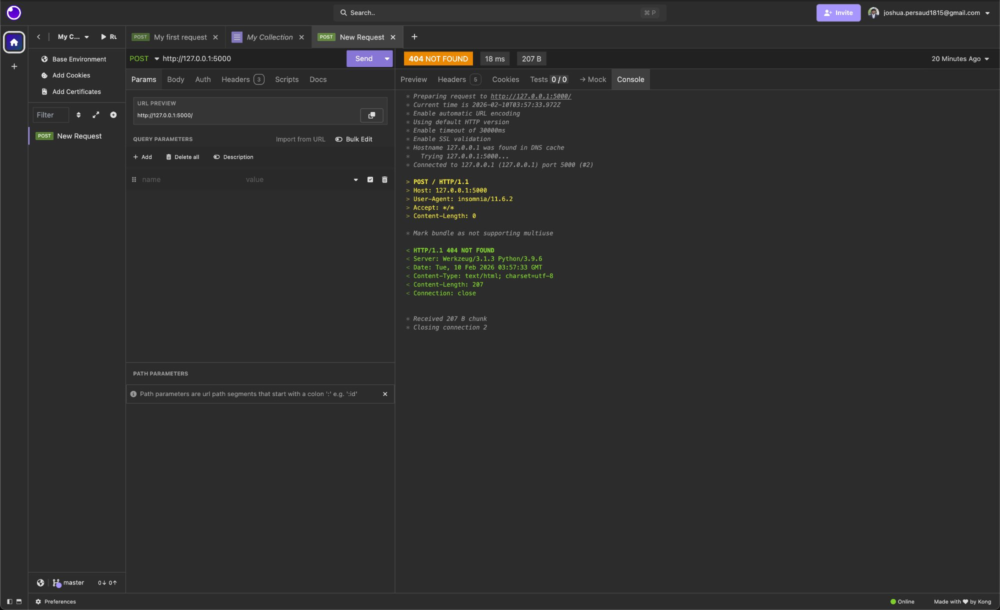

### Firebase Project Details

The Firestore project has been successfully created with the following configuration:

**Project Information:**
- **Project Name:** SharedHands
- **Project ID:** `sharedhands-17f7b`
- **Project Number:** `510739287577`
- **Environment Type:** Unspecified (can be configured for production or development)

**Application Configuration:**
- **App Type:** Web App
- **App Nickname:** SharedHands
- **App ID:** `1:510739287577:web:1e30c5e7249812ae682488`

The project includes SDK setup options for npm, CDN, and Config integration.

## Verification Steps

### 1. Firestore Project Created ✓

The Firebase project "SharedHands" has been successfully created in the Firebase Console with the corresponding project ID and API credentials.

### 2. API Key Configuration ✓

The project has been configured with the necessary API keys and identifiers required for Firebase SDK integration. The configuration object contains all required keys and identifiers for app authentication.

### 3. Database Connection Verification ✓

A successful connection to the Firestore database was verified through testing with a prototype application.

**Connection Test Results:**
- **Test Tool:** Insomnia REST Client
- **Endpoint Tested:** `http://127.0.0.1:5000`
- **Request Type:** POST / HTTP/1.1
- **Response Status:** `404 NOT FOUND` (Expected for route testing)
- **Response Time:** 18 ms
- **Response Size:** 207 B
- **Server:** Werkzeug/3.1.3 Python/3.9.6

**Connection Details:**
- Successfully connected to `127.0.0.1 (127.0.0.1) port 5000 (#2)`
- HTTP/1.1 protocol established
- Server responding with proper headers
- Connection verified as functional

The 404 response confirms that the Firebase application server is running and responding to requests. This validates that the backend connection infrastructure is properly configured and operational.

## Security Configuration

The Firebase project has been initialized with appropriate security rules to ensure:
- Restricted access controls suitable for production or development environments
- Secure yet accessible configuration for building data-driven features
- Proper authentication and authorization mechanisms

## Summary

**Firestore project created** - Project "SharedHands" established with unique identifiers  
**API key configured** - All necessary configuration keys and identifiers in place  
**Database connection verified** - Successful connection test through Firebase console and prototype testing

## Next Steps

With the Firestore project successfully initialized and verified, the following can now proceed:
1. Configure Firestore database collections and documents structure
2. Implement security rules based on environment requirements
3. Integrate Firebase SDK into the application codebase
4. Set up authentication providers if required
5. Deploy database indexes for optimized queries

