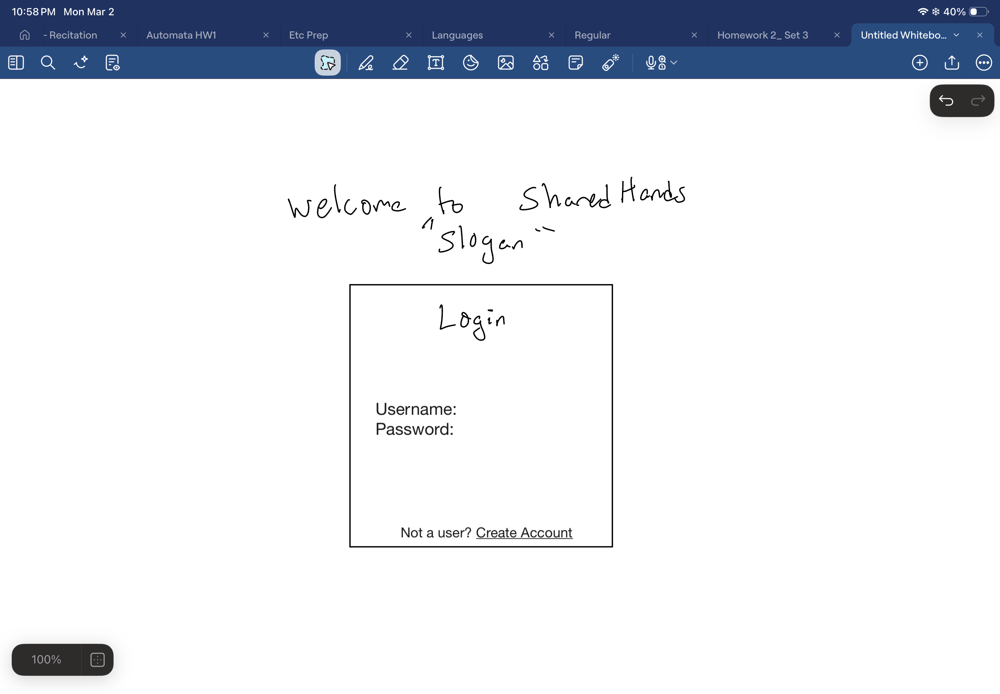
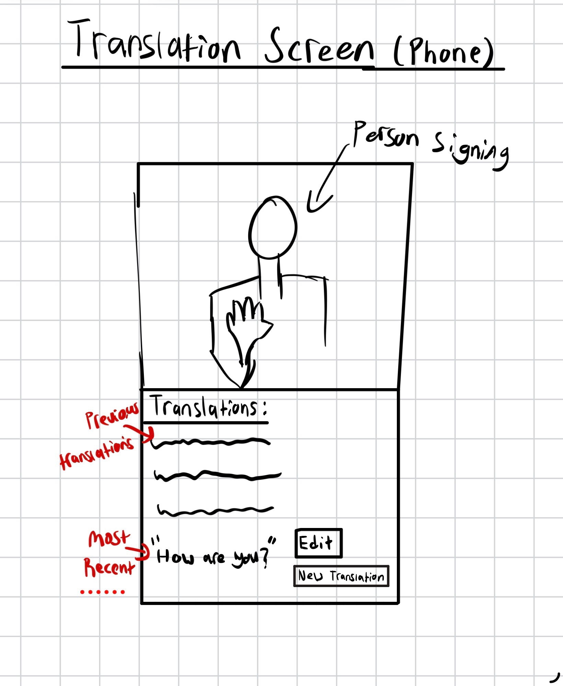
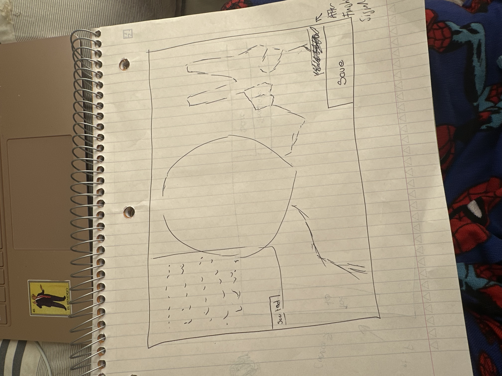

# Discussion for design

- linked above are 3 images the other group members have drawn for differnet pages of sharedHands
  which include the login page, and the main translation page in both mobile and desktop versions.

- in terms of styling the general consesus was to have a blue green and white color scheme

- the discussion on the general design of the elements within the pages were that we prefered a more smoother look to elements rather than rigid
  boxes

# current design criteria/choices

- green and blue color scheme with a white background/contrast

- most elements within the page like buttons or text boxes should have a smoother look (rounded edges)

- the layout of pages shall resemble the drafts the other team members have created and can be adjusted as needed
