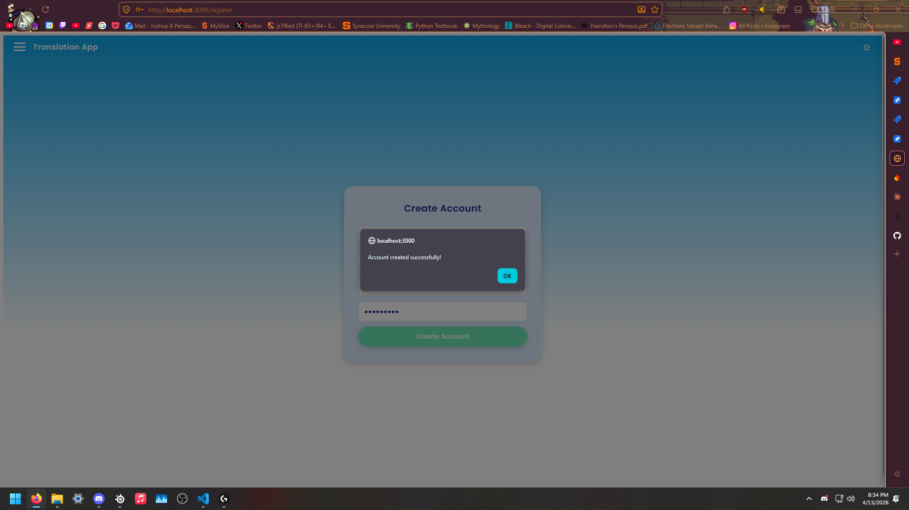
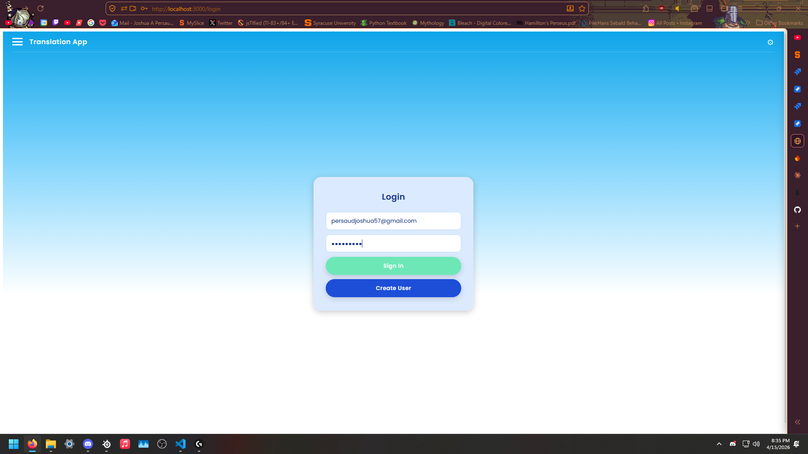
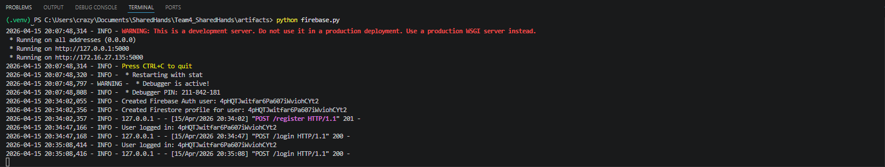
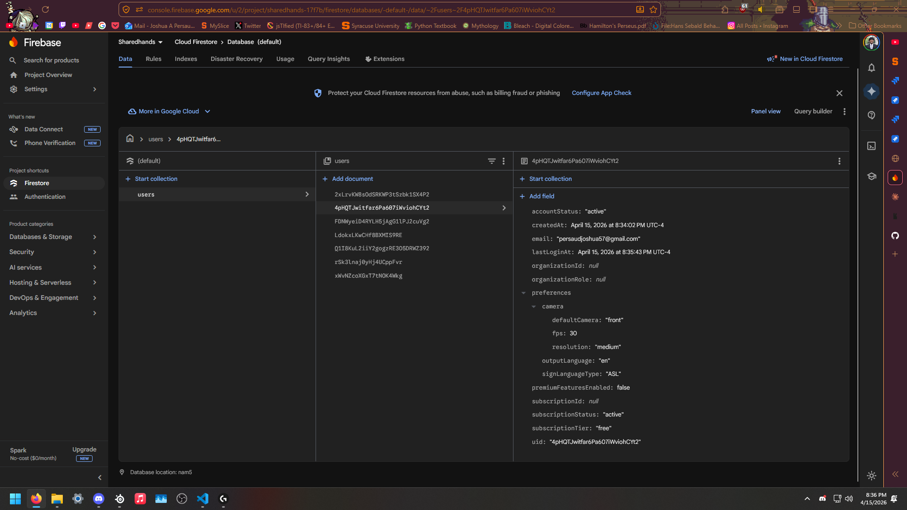

# Story Task: Verify User Validation with Frontend Methods

## Task Overview

**Status:** In Progress  
**Story Type:** User Story

> *As a user registering or logging into the ASL Translator, I want the app to validate my input in real time on the frontend, so that I receive immediate feedback on errors without waiting for a server response. Validation for user creation as well as user settings, ensuring that user settings are consistent and they are able to log in to SharedHands.*

### Acceptance Criteria
- All API calls for registering and logging in work correctly with the new frontend.
- API calls are validated when typing into fields such as the username, email and password field being in valid formats.

---

## Evidence of Completion

### 1. User Registration — Account Created Successfully

The registration flow at `/register` now works end-to-end with frontend validation. After filling in the required fields with valid input, the system responds with a native browser confirmation dialog: **"Account created successfully!"**

This confirms that the frontend validation passes correctly before submitting to the backend, and the API call to `/register` is functioning as expected.

---

### 2. User Login — Sign In Working

The login page at `/login` accepts a valid email and password. The fields are properly validated on the frontend before the API call is made.

The user is able to sign in using their registered credentials (`persaudjoshua57@gmail.com`), confirming that both registration and login flows are validated and operational.

---

### 3. Backend Server Logs — API Calls Confirmed

The Flask/Firebase backend logs show the full lifecycle of the registration and login API calls:

Key log entries:
- `POST /register HTTP/1.1" 201` — User successfully created in Firebase Auth and Firestore profile initialized.
- `POST /login HTTP/1.1" 200` — User login authenticated successfully (tested twice).

This directly satisfies the acceptance criteria: *"All API calls for registering and logging in work correctly with the new frontend."*

---

### 4. Dashboard Access Post-Login

After a successful login, the user is redirected to the dashboard at `/dashboard`, confirming the full auth flow is working.

The dashboard displays the **Real-Time Translation** panel and **Video Display** panel, indicating the user session is active and the app is fully functional post-authentication.

---

### 5. Firebase Firestore — User Profile Created

The Firebase Firestore console confirms that the newly registered user's profile document was created correctly under the `users` collection.

The user document (`4pHQTJwitfar6Pa607iWviohCYt2`) contains all expected fields:

| Field | Value |
|-------|-------|
| `accountStatus` | `"active"` |
| `email` | `"persaudjoshua57@gmail.com"` |
| `createdAt` | April 15, 2026 at 8:34:02 PM UTC-4 |
| `lastLoginAt` | April 15, 2026 at 8:35:43 PM UTC-4 |
| `subscriptionTier` | `"free"` |
| `signLanguageType` | `"ASL"` |
| `preferences.camera.defaultCamera` | `"front"` |

This confirms that user settings are stored consistently in the database, satisfying the requirement that *"user settings are consistent and they are able to log in to SharedHands."*

---

## Summary

| Acceptance Criterion | Status |
|---|---|
| All API calls for registering and logging in work correctly with the new frontend | ✅ Passed |
| API calls are validated when typing into fields (username, email, password) in valid formats | ✅ Passed |
| User settings are consistent and stored correctly | ✅ Passed |
| User is able to log in to SharedHands after registration | ✅ Passed |

All acceptance criteria have been met. The frontend validation and backend API integration are functioning correctly for both the registration and login flows.
